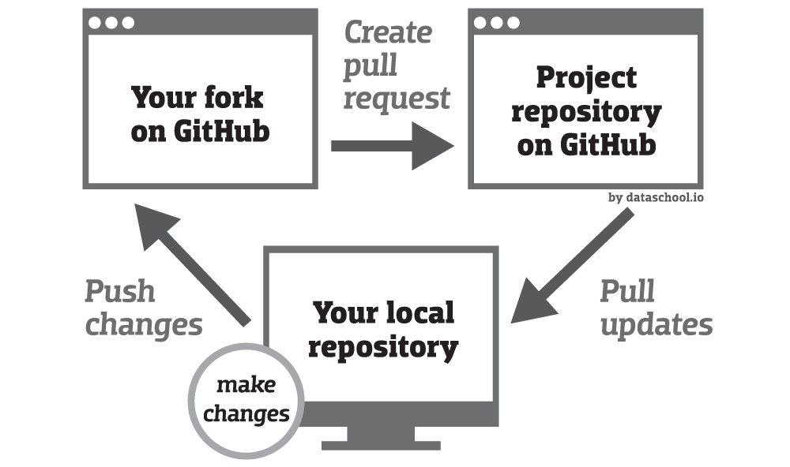

# 

[](LICENSE)
[](http://pixano.cea.fr/smart-annotation/)
[](https://www.npmjs.com/package/@pixano/graphics-2d)
<!--[](https://github.com/pixano/pixano-elements/workflows/Node.js%20CI/badge.svg)-->

## What is PIXANO ?
[Pixano](https://pixano.cea.fr/) is a web-based smart-annotation tool for computer vision applications. The modules are driven by artificial intelligence, which assists the human user with annotation tasks and accelerate the annotation process. Try some of our features [online](https://pixano.github.io/demo/demo.html)!

[](https://www.youtube.com/watch?v=z5T2HhnugJo)

Pixano Elements
===============

Pixano Elements - Library of web components dedicated to data annotation tasks.

A complete and ready-to-use annotation application is available at `https://github.com/pixano/pixano-app`.

[](https://www.youtube.com/watch?v=z5T2HhnugJo)

> IMPORTANT: The Pixano Web Components are a work in progress and subject to major changes until 1.0 release.

[Playcode demo](https://playcode.io/709884/) ([smart-segmentation](https://playcode.io/723293/), [cuboid](https://playcode.io/709984/), [rectangle](https://playcode.io/709884/), [smart-rectangle](https://playcode.io/738813/))

[Website demos](https://pixano.github.io/demo/demo)

[Features video](https://www.youtube.com/watch?v=z5T2HhnugJo)

Automatic build tests on Ubuntu (latest) and node version 10, 12, 14.

## Table of content
  * [Components overview](#components-overview)
  * [Requirements](#requirements)
      - [Node installation on Windows](#node-installation-on-windows)
      - [Node installation on Ubuntu](#node-installation-on-ubuntu)
      - [Other Operating Systems](#other-operating-systems)
  * [Build and run the overall demo](#build-and-run-the-overall-demo)
  * [Documentation](#documentation)
  * [How to contribute ?](#how-to-contribute-)
    + [Getting started](#getting-started)
    + [First time](#first-time)
      + [Fork and clone](#fork-and-clone)
      + [First run](#first-run)
    + [Modify and test the code](#modify-and-test-the-code)
    + [Create a pull request](#create-a-pull-request)
  * [Change log](#change-log)
  * [License](#license)


## Components overview

The Pixano Elements are divided into `packages`. Each package can be installed independantly from [NPM](https://www.npmjs.com/) using the following command:

```
npm install @pixano/graphics-2d
```

Each package can contain multiple web components which are regrouped by affinity.


| Component | Status | Demo |
| ----------| -------| -----|
| [`<pxn-rectangle>`](https://github.com/pixano/pixano-elements/blob/master/packages/graphics-2d) | [](https://www.npmjs.com/package/@pixano/graphics-2d) | [demo](http://pixano.cea.fr/bounding-box/) |
| [`<pxn-polygon>`](https://github.com/pixano/pixano-elements/blob/master/packages/graphics-2d) |  [](https://www.npmjs.com/package/@pixano/graphics-2d) | [demo](http://pixano.cea.fr/polygon/) |
| [`<pxn-segmentation>`](https://github.com/pixano/pixano-elements/blob/master/packages/graphics-2d) | [](https://www.npmjs.com/package/@pixano/graphics-2d) | [demo](http://pixano.cea.fr/pixelwise/) |
| [`<pxn-keypoints>`](https://github.com/pixano/pixano-elements/blob/master/packages/graphics-2d) | [](https://www.npmjs.com/package/@pixano/graphics-2d) | [demo](http://pixano.cea.fr/keypoint/) |
| [`<pxn-smart-rectangle>`](https://github.com/pixano/pixano-elements/blob/master/packages/graphics-2d) | [](https://www.npmjs.com/package/@pixano/graphics-2d) | [demo](http://pixano.cea.fr/smart-annotation/) |
| [`<pxn-cuboid-editor>`](https://github.com/pixano/pixano-elements/blob/master/packages/graphics-3d) | [](https://www.npmjs.com/package/@pixano/graphics-3d) | [demo](http://pixano.cea.fr/3d-bounding-box/) |


## Requirements

Pixano requires WebGL to be activated in your browser. If you see the following error in you console `WebGL unsupported in this browser`, please [activate](https://superuser.com/questions/836832/how-can-i-enable-webgl-in-my-browser) it.

For development, you will only need Node.js installed in your environement.

- #### Node installation on Windows

  Just go on [official Node.js website](https://nodejs.org/) and download the installer.
Also, be sure to have `git` available in your PATH, `npm` might need it (You can find git [here](https://git-scm.com/)).

- #### Node installation on Ubuntu

  You can install nodejs and npm easily with apt install, just run the following commands.
    ```bash
    sudo apt install nodejs
    sudo apt install npm
    ```
  Or install it with snap: `sudo snap install node`

- #### Other Operating Systems
  You can find more information about the installation on the [official Node.js website](https://nodejs.org/) and the [official NPM website](https://npmjs.org/).

If the installation was successful, you should be able to run the following command.

```bash
node --version
# v10.19.0

npm --version
# 6.10.0
```
#### note about npm version
If you need to install a specific version of npm, you can use the following command line:
```bash
npm install -g npm@6.10.0
```
> If you encounter "EACCES: permission denied" error message, please follow [this guide](https://docs.npmjs.com/resolving-eacces-permissions-errors-when-installing-packages-globally).


## Build and run the overall demo
An online serverless demo is available on our dedicated [website](https://pixano.github.io/demo/demo).

If you want to build the latests version, it's easy:
```
git clone https://github.com/pixano/pixano-elements.git
cd pixano-elements
npm run deps
npm run build
npx serve demo
```

## Documentation

📚 Check out the [TypeDoc](https://pixano.github.io/docs/docs) documentation. Each package's usage and API is also documented:

- [graphics-2d](https://github.com/pixano/pixano-elements/blob/master/packages/graphics-2d)
- [graphics-3d](https://github.com/pixano/pixano-elements/blob/master/packages/graphics-2d)


You can also try the demos on our [website](http://pixano.cea.fr/bounding-box/).


## How to contribute ?

### Getting started

To create a new component, check our [tutorial](./documentation/how_to_create_a_new_component.md).

Please follow our [coding guidelines](./documentation/coding_guidelines.md) for your contributions.

#### About the contribution process

The contribution process follows this well-known diagram :



### First time:
#### Fork and clone

1. Fork this project

	*Click on the Fork button*
	
2. Clone the fork on your local machine
```bash
	git clone git@github.com:$YOURLOGIN/pixano-elements.git
	# OR
	git clone https://github.com/$YOURLOGIN/pixano-elements.git
	# go to code
	cd pixano-elements
```
3. Add the original repository as a remote called upstream
```bash
	git remote add upstream git@github.com:pixano/pixano-elements.git
	# OR
	git remote add upstream https://github.com/pixano/pixano-elements.git
```

#### First run
4. Install dependencies and build the project
```bash
cd pixano-elements
npm run deps
npm run build
```

5. Run the demo locally:

```bash
npx serve demo
```


### Modify and test the code

1. Check that you are on the right branch and pull upstream changes into your local repository if necessary
```bash
	git checkout master
	git pull upstream master
```
2. Create a new branch to work on
```bash
	git checkout -b $MY_BRANCH_NAME
```
3. Implement/fix your feature, comment your code.

4. Test your modifications locally using the serverless-demo
```bash
	npm run build
	npx serve demo
```
*This demo takes your local modifications into account, thanks to a bootstrap step.*


If you modified the dependencies, you better clean the project before rebuilding:

```bash
	npm run clearall
	npm run deps
	npm run build
	npx serve demo
```

### Create a pull request

5. Add or change the documentation as needed.
6. Commit your modifications using meaningfull comments.
7. Push your branch to your fork
```bash
	git push origin $MY_BRANCH_NAME
```
8. On github, open a pull request from your fork in the correct branch.

	*A green button "Compare & pull request" should appear. If not, click on branches button (https://github.com/$YOURLOGIN/pixano-elements/branches) and then click the "New pull request" button corresponding to your contribution branch.*

9. Complete the merge request message with a meaningfull title and a comprehensive comment : describe how your work is changing Pixano and what modules are impacted.
10. click on "Create pull request" => automatic verifications are made by github

Nice work ! Thank you for contributing to Pixano !


## Change log

[Releases](https://github.com/pixano/pixano-elements/releases)

## License

Pixano is released under the [CeCILL-C](LICENSE.txt) license, a free software license
 adapted to both international and French legal matters that is fully compatible
 with the FSF's GNU/LGPL license.
